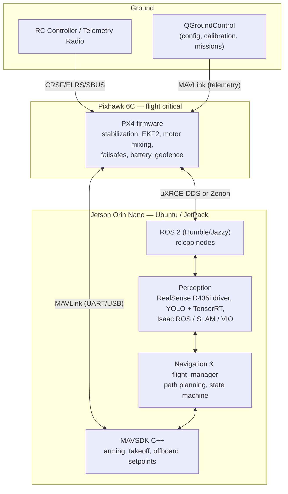
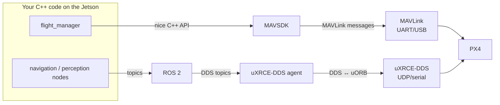

Your `NOTES.md` already has the right instincts — here's the complete picture, organized layer by layer, followed by a clear disambiguation of the five technologies you listed (they are **not** interchangeable — they solve different problems at different layers).

## Full tech stack for PX4 + Jetson autonomous drone



### Layer-by-layer breakdown

| Layer | Technology | Role |
|---|---|---|
| Flight firmware | **PX4** | Stabilization, attitude/position control, EKF2, failsafes, battery monitoring, motor mixing. Owns flight safety. |
| Flight config/ground | **QGroundControl** | Firmware install, airframe setup (X500 V2), sensor calibration, PX4 parameter tuning, mission planning, flight monitoring. |
| RC link | **ExpressLRS / CRSF / SBUS** | Manual pilot input to the Pixhawk — independent of the Jetson entirely. |
| Companion OS | **Ubuntu 22.04/24.04 + JetPack** (L4T, CUDA, TensorRT, cuDNN) | Base environment on the Orin Nano. |
| Perception framework | **ROS 2** | Node graph, topics, TF, launch system. Camera/IMU/SLAM/YOLO all live here. |
| Camera driver | **realsense-ros** | Publishes D435i color, depth, IMU topics + TF frames. |
| Inference | **YOLO + TensorRT** | Object detection, accelerated on the Orin's GPU. |
| SLAM/VIO | **Isaac ROS Visual SLAM / RTAB-Map / VINS** | "Where am I relative to the environment." Don't write your own. |
| PX4↔ROS 2 bridge | **uXRCE-DDS** (or Zenoh) | Exposes PX4's internal uORB topics as ROS 2 topics. |
| Flight commands | **MAVSDK C++** | Arming, takeoff, land, offboard velocity/position setpoints, telemetry. |
| Wire protocol | **MAVLink** | The actual byte protocol between Jetson and Pixhawk (and QGC). |

---

## The five technologies — what each actually is

The key insight: **these operate at different layers and different directions of the stack.** MAVLink and uXRCE-DDS are *protocols/middleware*; MAVSDK and ROS 2 are *APIs/frameworks*; Zenoh is an alternative transport.

### 1. MAVLink — the wire protocol
- A binary message protocol (the lingua franca of drones, ~20 years old).
- Defines messages like `HEARTBEAT`, `ATTITUDE`, `SET_POSITION_TARGET_LOCAL_NED`, `COMMAND_LONG`.
- Runs over UART, USB, UDP, TCP.
- **This is what physically travels between the Jetson and the Pixhawk** (and between QGC and the Pixhawk).
- You almost never write raw MAVLink by hand — you use it *through* MAVSDK or the bridge.

### 2. MAVSDK C++ — the friendly flight-command API
- A C++ (and Python, Swift, etc.) library that **wraps MAVLink** into a clean async API.
- Talks to the Pixhawk over MAVLink — same wire protocol, much nicer code.
- Its scope is **vehicle control and telemetry**: arming, takeoff, land, missions, offboard setpoints, camera, gimbal.

```cpp
// MAVSDK: high-level flight actions
auto action = mavsdk::Action{system};
action.arm();
action.takeoff();
mavsdk::Offboard::VelocityNedYaw vel{2.0f, 0.0f, 0.0f, 0.0f};
offboard.set_velocity_ned(vel);
```

- **Does not know anything about ROS 2, cameras, or SLAM.** It's purely the "talk to the flight controller" library.
- This is what your `flight_manager` should use to actually command the vehicle.

### 3. ROS 2 — the robotics application framework
- Not a protocol, not a flight API — a **framework for building distributed robotics software**: nodes, topics/services/actions, TF transforms, launch system, lifecycle management.
- This is where your **perception stack lives**: RealSense driver node, YOLO node, SLAM node, navigation node.
- It has **no built-in ability to command a PX4 drone** — it needs a bridge (below) or a MAVSDK wrapper node to reach the flight controller.

### 4. uXRCE-DDS — the PX4↔ROS 2 bridge
- PX4's internal state lives in **uORB** topics (its own pub/sub system). ROS 2's native transport is **DDS**.
- **uXRCE-DDS is a lightweight DDS bridge**: a client runs inside PX4 on the Pixhawk, an agent runs on the Jetson, and it *translates uORB topics ↔ ROS 2 topics*.
- Result: your ROS 2 nodes can subscribe directly to `/fmu/out/vehicle_odometry` and publish to `/fmu/in/trajectory_setpoint` — PX4's internals appear as native ROS 2 topics.
- **This is the officially supported bridge** (PX4 v1.14+ replaced the old micrortps bridge with it). It's how you do *tight* offboard control from ROS 2 — e.g., feeding position setpoints from your SLAM/navigation stack at high rate.
- Note: it exposes **low-level topics**, not high-level actions. "Arm" and "takeoff" become raw topic publications / command messages — more power, more responsibility.

### 5. Zenoh — the alternative transport
- A modern pub/sub/query middleware (written in Rust) that is **faster and lighter than DDS**, designed for constrained and wireless networks.
- PX4 v1.15+ added **Zenoh as an alternative to uXRCE-DDS** for the same job: bridging uORB topics to a companion computer. These are the only two supported middlewares — which your notes correctly flagged.
- In the ROS 2 world, Zenoh is also emerging as an alternative to DDS via `rmw_zenoh_cpp`.
- **Practical guidance:** uXRCE-DDS is the mature, best-documented default with the largest community. Choose Zenoh only if you hit DDS's pain points (discovery overhead, wireless flakiness, bandwidth). For a first build, use uXRCE-DDS.

---

## How they fit together (the mental model)



| | MAVLink | MAVSDK C++ | ROS 2 | uXRCE-DDS | Zenoh |
|---|---|---|---|---|---|
| **What it is** | Wire protocol | C++ API over MAVLink | Robotics framework | uORB↔DDS bridge | Alternative transport/bridge |
| **Layer** | Transport | Vehicle control API | Application | Transport/bridge | Transport/bridge |
| **Used for** | Everything FC-bound | Arm/takeoff/offboard/telemetry | Perception, SLAM, TF, nav | Streaming PX4 topics into ROS 2 | Same as uXRCE-DDS, faster/lighter |
| **You write against it?** | Rarely directly | Yes | Yes | No (it's infrastructure) | No (it's infrastructure) |

## Practical recommendation for your project

1. **MAVSDK C++** for the `flight_manager` state machine (`DISCONNECTED → CONNECTED → READY → ARMED → TAKEOFF → AUTONOMOUS → LANDING → FAILSAFE`) — it's the simplest safe path to offboard control, and it works in SITL simulation on your Windows machine today.
2. **ROS 2 + realsense-ros + TensorRT YOLO + Isaac ROS** for everything perception.
3. **uXRCE-DDS** as the bridge when you need PX4 odometry inside ROS 2 or want to stream setpoints from your navigation stack. Add Zenoh later only if DDS gives you trouble.
4. **MAVLink** — you'll see it in logs and QGC, but you shouldn't write it directly.

This matches the rule in your notes: **PX4 owns safety and stabilization; the Jetson proposes high-level movement** — MAVSDK is how it proposes, ROS 2 is how it perceives, and uXRCE-DDS/Zenoh is how the two worlds share state.